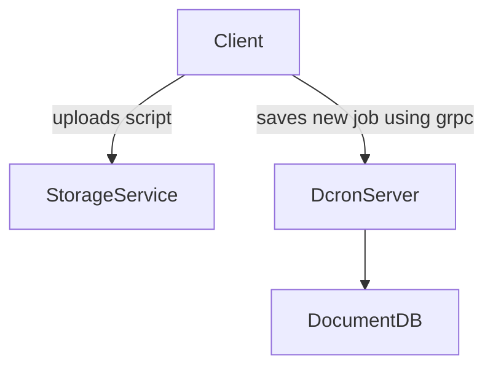
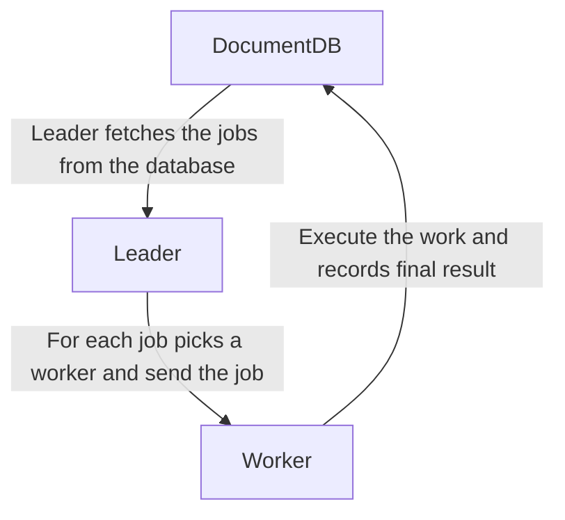

# dcron
**Status**: WIP

# Overview
The idea for this project is to enable users to schedule and run cron-like jobs without having to worry about *where* the script will run. For this to happen a client should be able to talk with any server to schedule a job or retrieve a job result/log. In order to keep the logs accessible by a web-interface, once the job is done 
the log will be uploaded to a object storage service (such as S3, ceph or openstack Swift). The client will also upload the script it wants to run in a object storage service and only give to the server the time it wants it to run (using cron-syntax) and the intepreter the server should use to run it.

If the job is set for every 5 minutes and one execution is taking more than that, the next execution will be delayed until the job is finished.

The service itself uses a DocumentDB such as https://couchdb.apache.org/ to store its data.

The service assumes the client is trustworth, so there won't be any complex check regarding the safety of scripts.

## API

For the public API, look at the proto/dcron.proto `Public` service definition. `dcron-client` is a client of that gRPC. The `Internal` service is used for the communication between Leader and followers.

## Job creation

Every client is responsible for uploading the job script to the Object Storage Service, basically every client does the following to add a new service:

### Communication between leader and workers

The distributed system has an active (leader) node, which is responsible for polling the database every minute. When there is a new job to be executed, it sends to a node (for now based on round-robin). If the worker is busy, it can refuse to execute the job.

There is no need for the worker to communicate back the result of the job*, it just need to update the DocumentDB. The job can have a timeout, in which case, the leader will retry the job again in another node after the timeout. If the job does not have a timeout set, the leader will wait forever for the execution to finish (failing or succeeding) and may need manual intervention.

*not sure about it, need to think better on edge cases regarding timeouts.

## Implementation Details

### Leader Role

The leader only needs to coordinate which machine is going to run which job. The machines can talk directly to the documentDB to save result of jobs and to insert new jobs.

The Execution document at the Database is append-only, meaning that if due to timeout two machines execute the same job, both executions will be kept at the database.

Timeouts can be set to zero, meaning the service won't retry the job until the executions finishes. You still should always write your scripts keeping in mind two jobs can run in paralell (in case of network split).

### Libre Software

This will be a Free Software as defined by the Free Software Foundation: https://www.gnu.org/philosophy/free-sw.html

# Thought about, not used

Consensus: https://raft.github.io/
